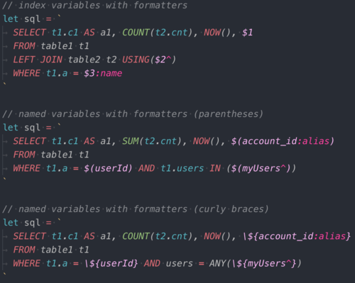

# sbks-vscode-grammar

Extended grammar for JavaScript to improve support for SQL development in JS.

## Installation

The package is not published to the Marketplace. Manual installation is required.

Download `sbks-vscode-grammar-N.N.N.vsix` file from [Releases](https://github.com/Gobie/sbks-vscode-grammar/releases) and run `code --install-extension sbks-vscode-grammar-N.N.N.vsix`.

## Features

* Syntax highlighting support for SQL inside template strings

  ```js
  sql = `...`
  sql += `...`
  /* sql */`...`
  .none(`...`
  .one(`...`
  .oneOrNone(`...`
  .many(`...`
  .manyOrNone(`...`
  .any(`...`
  ```

  

* Syntax highlighting support for pg-promise's template variables in SQL inside template strings

  ```js
  sql = `
    SELECT * FROM id = $(1)
    SELECT * FROM id = \${1}
    SELECT * FROM id = \${1:name}
    SELECT * FROM id = $(1^)
  `
  ```

  

* Syntax highlighting support for `[PG INDEX]` in comments

  ```js
  // [PG INDEX] full_index_name, another_index_name
  ```

  

## Grammar scopes

* `meta.embedded.block.sql` - entire template string with SQL syntax
* `punctuation.definition.template.begin.sql` - `\${`, `$(`
* `punctuation.definition.template.end.sql` - `}`, `)`
* `meta.embedded.template.expression.sql` - `\${var}`, `$(var)`, `$1`
* `meta.embedded.template.variable.sql` - `var`, `1`
* `meta.filter.full.sql` - [full formatting filter](https://github.com/vitaly-t/pg-promise#formatting-filters) (`:name`, `:raw`, etc)
* `meta.filter.short.sql` - [short formatting filter](https://github.com/vitaly-t/pg-promise#formatting-filters) (`^`, `~`, `#`)
* `keyword.pg-index` - `[PG INDEX]`

More information can be found in extension's `syntaxes/sql-injection.json`.

## Example settings

```json
"editor.tokenColorCustomizations": {
  "textMateRules": [
    {
      "name": "SQL block",
      "scope": "meta.embedded.block.sql",
      "settings": {
        "fontStyle": "italic"
      }
    },
    {
      "name": "SQL template expression",
      "scope": "meta.embedded.template.expression.sql",
      "settings": {
        "foreground": "#fcb8f6",
      }
    },
    {
      "name": "SQL formatting filter",
      "scope": "meta.filter.full.sql, meta.filter.short.sql",
      "settings": {
        "foreground": "#ff42a1",
      }
    },
  ]
},
```
